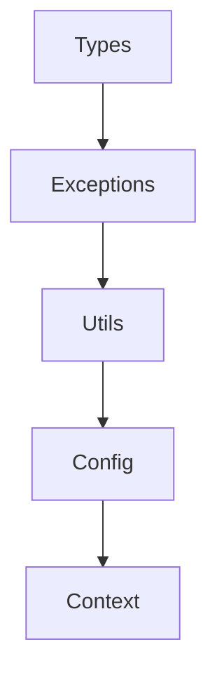
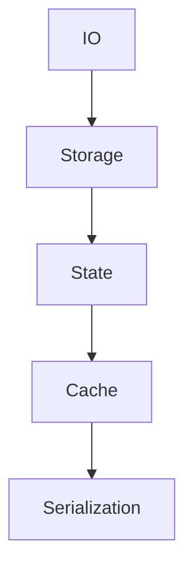
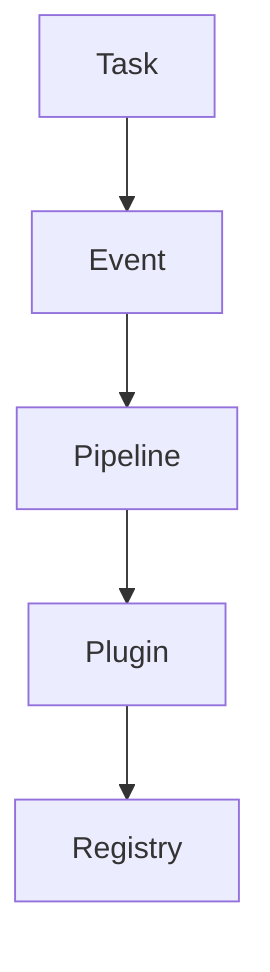
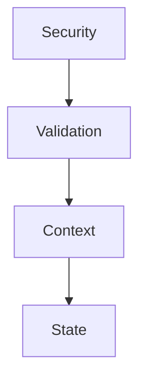

# PepperPy Core - Visão Geral

O PepperPy Core é uma biblioteca de utilitários projetada para acelerar o desenvolvimento de aplicações Python, fornecendo componentes reutilizáveis e padrões comuns de desenvolvimento.

## Arquitetura

A biblioteca é organizada em módulos independentes mas integrados, cada um focado em uma área específica de funcionalidade:

### Módulos Fundamentais

1. **Types** (`types.py`)
   - Definições de tipos base
   - Classes genéricas
   - Protocolos e interfaces
   - Utilitários de tipagem

2. **Config** (`config.py`)
   - Gerenciamento de configurações
   - Carregamento de configurações
   - Validação de configurações
   - Ambientes configuráveis

3. **Exceptions** (`exceptions.py`)
   - Hierarquia de exceções
   - Tratamento de erros
   - Exceções customizadas
   - Contexto de erro

### Módulos de Infraestrutura

4. **IO** (`io.py`)
   - Operações de arquivo
   - Streams assíncronos
   - Buffers de dados
   - Gerenciamento de recursos

5. **Network** (`network.py`)
   - Clientes HTTP
   - WebSockets
   - Gerenciamento de conexões
   - Protocolos de rede

6. **Storage** (`storage.py`)
   - Armazenamento persistente
   - Cache em memória
   - Backends plugáveis
   - Gerenciamento de dados

### Módulos de Estado e Dados

7. **State** (`state.py`)
   - Gerenciamento de estado
   - Observadores de mudança
   - Persistência de estado
   - Sincronização

8. **Cache** (`cache.py`)
   - Cache em memória
   - Políticas de cache
   - Invalidação
   - Estatísticas

9. **Context** (`context.py`)
   - Contexto de execução
   - Escopo de dados
   - Propagação de contexto
   - Isolamento

### Módulos de Processamento

10. **Task** (`task.py`)
    - Gerenciamento de tarefas
    - Filas de trabalho
    - Execução assíncrona
    - Agendamento

11. **Event** (`event.py`)
    - Sistema de eventos
    - Pub/Sub
    - Handlers assíncronos
    - Roteamento de eventos

12. **Pipeline** (`pipeline.py`)
    - Processamento em pipeline
    - Transformação de dados
    - Composição de operações
    - Fluxos de trabalho

### Módulos de Segurança

13. **Security** (`security.py`)
    - Autenticação
    - Autorização
    - Criptografia
    - Proteção de dados

14. **Validation** (`validation.py`)
    - Validação de dados
    - Schemas
    - Regras customizadas
    - Sanitização

### Módulos de Desenvolvimento

15. **Testing** (`testing.py`)
    - Testes assíncronos
    - Mocks e stubs
    - Fixtures
    - Asserções

16. **Dev** (`dev.py`)
    - Utilitários de desenvolvimento
    - Debugging
    - Profiling
    - Ferramentas

### Módulos de Monitoramento

17. **Logging** (`logging.py`)
    - Logging estruturado
    - Formatadores
    - Handlers
    - Níveis de log

18. **Telemetry** (`telemetry.py`)
    - Métricas
    - Tracing
    - Monitoramento
    - Alertas

### Módulos de Extensibilidade

19. **Plugin** (`plugin.py`)
    - Sistema de plugins
    - Carregamento dinâmico
    - Hooks
    - Extensões

20. **Registry** (`registry.py`)
    - Registro de componentes
    - Service locator
    - Injeção de dependência
    - Gerenciamento de ciclo de vida

### Módulos de Utilidade

21. **Utils** (`utils.py`)
    - Funções utilitárias
    - Helpers
    - Decoradores
    - Conversões

22. **Serialization** (`serialization.py`)
    - Serialização de dados
    - Formatos suportados
    - Conversores
    - Schemas

23. **Resources** (`resources.py`)
    - Gerenciamento de recursos
    - Carregamento
    - Cleanup
    - Pooling

## Relações e Dependências

### Core Dependencies



### Data Flow



### Processing Flow



### Security Flow



## Padrões de Design

A biblioteca implementa vários padrões de design comuns:

1. **Criacionais**
   - Factory Method
   - Builder
   - Singleton
   - Dependency Injection

2. **Estruturais**
   - Adapter
   - Bridge
   - Composite
   - Decorator
   - Facade

3. **Comportamentais**
   - Observer
   - Strategy
   - Command
   - Chain of Responsibility
   - Visitor

## Melhores Práticas

1. **Desenvolvimento**
   - Use type hints
   - Documente código
   - Escreva testes
   - Siga PEP 8

2. **Performance**
   - Use async/await
   - Implemente cache
   - Otimize I/O
   - Profile código

3. **Segurança**
   - Valide input
   - Sanitize dados
   - Use HTTPS
   - Encripte dados

4. **Manutenção**
   - Monitore erros
   - Faça logging
   - Atualize deps
   - Documente mudanças

## Exemplos de Uso

### Aplicação Básica

```python
from pepperpy_core import (
    Config,
    StateManager,
    TaskManager,
    EventManager
)

async def main():
    # Configuração
    config = Config.load("config.yaml")
    
    # Estado
    state = StateManager()
    await state.initialize()
    
    # Eventos
    events = EventManager()
    await events.start()
    
    # Tarefas
    tasks = TaskManager()
    await tasks.start()
    
    try:
        # Lógica principal
        await run_application(
            config=config,
            state=state,
            events=events,
            tasks=tasks
        )
    finally:
        # Cleanup
        await tasks.stop()
        await events.stop()
        await state.cleanup()
```

### Processamento de Dados

```python
from pepperpy_core import (
    Pipeline,
    Storage,
    Validation
)

async def process_data():
    # Validação
    validator = Validation.create_schema({
        "name": str,
        "age": int,
        "email": "email"
    })
    
    # Storage
    storage = Storage.create("data")
    
    # Pipeline
    pipeline = (
        Pipeline()
        .add_step(validator.validate)
        .add_step(transform_data)
        .add_step(storage.save)
    )
    
    # Processar
    result = await pipeline.process(data)
```

### API Segura

```python
from pepperpy_core import (
    Security,
    Validation,
    Logging
)

async def secure_endpoint():
    # Segurança
    security = Security()
    
    # Validação
    validator = Validation()
    
    # Logging
    logger = Logging.get_logger()
    
    try:
        # Autenticar
        user = await security.authenticate(token)
        
        # Validar
        data = await validator.validate(request.data)
        
        # Processar
        result = await process_data(user, data)
        
        # Log
        await logger.info("Operação sucesso", extra={
            "user": user.id,
            "operation": "process"
        })
        
        return result
    except Exception as e:
        # Log erro
        await logger.error("Operação falhou", exc_info=e)
        raise
```

## Contribuindo

1. **Setup**
   ```bash
   # Clone
   git clone https://github.com/user/pepperpy-core.git
   
   # Install
   poetry install
   
   # Test
   pytest
   ```

2. **Guidelines**
   - Siga o estilo do código
   - Adicione testes
   - Documente mudanças
   - Faça PRs pequenos

3. **Workflow**
   - Fork o repo
   - Crie uma branch
   - Faça mudanças
   - Submeta PR

## Recursos

- [Documentação](docs/)
- [Exemplos](examples/)
- [Testes](tests/)
- [Changelog](CHANGELOG.md)
``` 