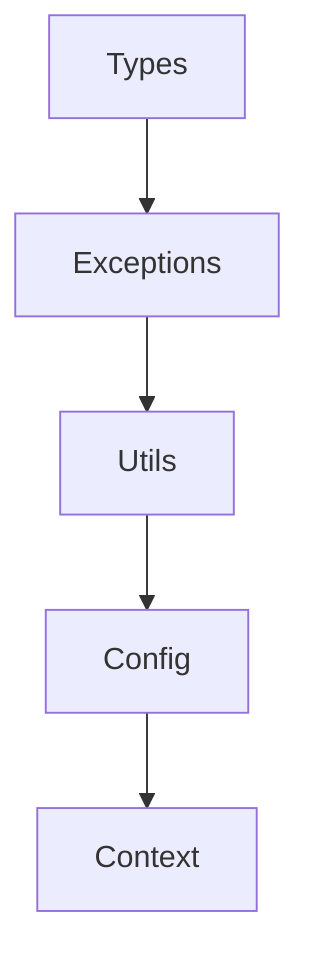
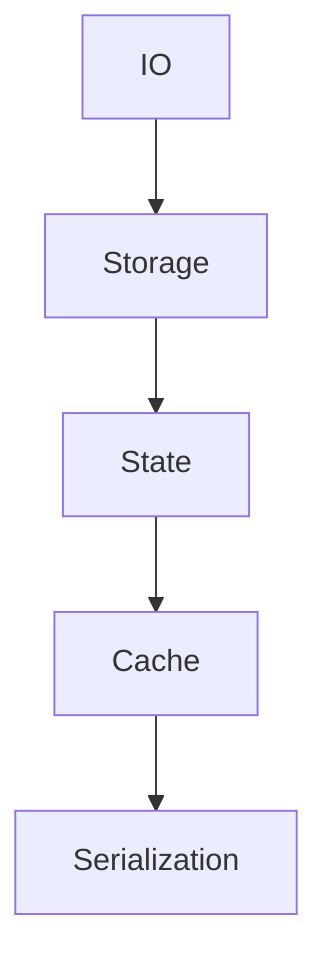
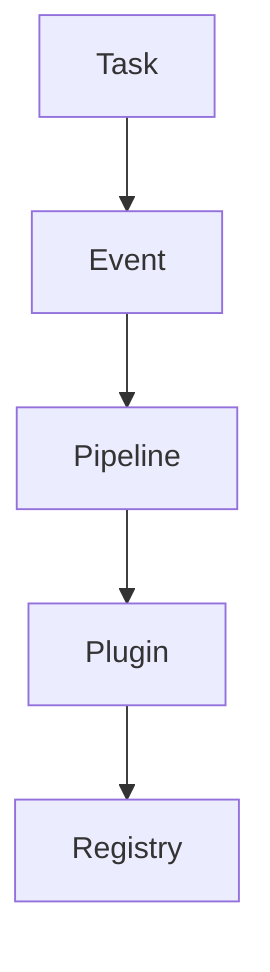
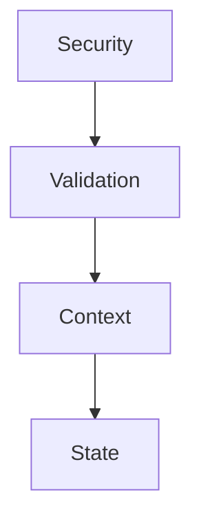

# PepperPy Core - Overview

PepperPy Core is a utility library designed to accelerate Python application development by providing reusable components and common development patterns.

## Architecture

The library is organized into independent but integrated modules, each focused on a specific area of functionality:

### Core Modules

1. **Types** (`types.py`)
   - Base type definitions
   - Generic classes
   - Protocols and interfaces
   - Typing utilities

2. **Config** (`config.py`)
   - Configuration management
   - Configuration loading
   - Configuration validation
   - Configurable environments

3. **Exceptions** (`exceptions.py`)
   - Exception hierarchy
   - Error handling
   - Custom exceptions
   - Error context

### Infrastructure Modules

4. **IO** (`io.py`)
   - File operations
   - Async streams
   - Data buffers
   - Resource management

5. **Network** (`network.py`)
   - HTTP clients
   - WebSockets
   - Connection management
   - Network protocols

6. **Storage** (`storage.py`)
   - Persistent storage
   - Memory cache
   - Pluggable backends
   - Data management

### State and Data Modules

7. **State** (`state.py`)
   - State management
   - Change observers
   - State persistence
   - Synchronization

8. **Cache** (`cache.py`)
   - Memory cache
   - Cache policies
   - Invalidations
   - Statistics

9. **Context** (`context.py`)
   - Execution context
   - Data scope
   - Context propagation
   - Isolation

### Processing Modules

10. **Task** (`task.py`)
    - Task management
    - Work queues
    - Asynchronous execution
    - Scheduling

11. **Event** (`event.py`)
    - Event system
    - Pub/Sub
    - Asynchronous handlers
    - Event routing

12. **Pipeline** (`pipeline.py`)
    - Pipeline processing
    - Data transformation
    - Operation composition
    - Workflow

### Security Modules

13. **Security** (`security.py`)
    - Authentication
    - Authorization
    - Encryption
    - Data protection

14. **Validation** (`validation.py`)
    - Data validation
    - Schemas
    - Custom rules
    - Sanitization

### Development Modules

15. **Testing** (`testing.py`)
    - Asynchronous tests
    - Mocks and stubs
    - Fixtures
    - Assertions

16. **Dev** (`dev.py`)
    - Development utilities
    - Debugging
    - Profiling
    - Tools

### Monitoring Modules

17. **Logging** (`logging.py`)
    - Structured logging
    - Formatters
    - Handlers
    - Log levels

18. **Telemetry** (`telemetry.py`)
    - Metrics
    - Tracing
    - Monitoring
    - Alerts

### Extensibility Modules

19. **Plugin** (`plugin.py`)
    - Plugin system
    - Dynamic loading
    - Hooks
    - Extensions

20. **Registry** (`registry.py`)
    - Component registry
    - Service locator
    - Dependency injection
    - Lifecycle management

### Utility Modules

21. **Utils** (`utils.py`)
    - Utility functions
    - Helpers
    - Decorators
    - Conversions

22. **Serialization** (`serialization.py`)
    - Data serialization
    - Supported formats
    - Converters
    - Schemas

23. **Resources** (`resources.py`)
    - Resource management
    - Loading
    - Cleanup
    - Pooling

## Relationships and Dependencies

### Core Dependencies



### Data Flow



### Processing Flow



### Security Flow



## Design Patterns

The library implements several common design patterns:

1. **Creational**
   - Factory Method
   - Builder
   - Singleton
   - Dependency Injection

2. **Structural**
   - Adapter
   - Bridge
   - Composite
   - Decorator
   - Facade

3. **Behavioral**
   - Observer
   - Strategy
   - Command
   - Chain of Responsibility
   - Visitor

## Best Practices

1. **Development**
   - Use type hints
   - Document code
   - Write tests
   - Follow PEP 8

2. **Performance**
   - Use async/await
   - Implement cache
   - Optimize I/O
   - Profile code

3. **Security**
   - Validate input
   - Sanitize data
   - Use HTTPS
   - Encrypt data

4. **Maintenance**
   - Monitor errors
   - Do logging
   - Update deps
   - Document changes

## Usage Examples

### Basic Application

```python
from pepperpy import (
    Config,
    StateManager,
    TaskManager,
    EventManager
)

async def main():
    # Configuration
    config = Config.load("config.yaml")
    
    # State
    state = StateManager()
    await state.initialize()
    
    # Events
    events = EventManager()
    await events.start()
    
    # Tasks
    tasks = TaskManager()
    await tasks.start()
    
    try:
        # Main logic
        await run_application(
            config=config,
            state=state,
            events=events,
            tasks=tasks
        )
    finally:
        # Cleanup
        await tasks.stop()
        await events.stop()
        await state.cleanup()
```

### Data Processing

```python
from pepperpy import (
    Pipeline,
    Storage,
    Validation
)

async def process_data():
    # Validation
    validator = Validation.create_schema({
        "name": str,
        "age": int,
        "email": "email"
    })
    
    # Storage
    storage = Storage.create("data")
    
    # Pipeline
    pipeline = (
        Pipeline()
        .add_step(validator.validate)
        .add_step(transform_data)
        .add_step(storage.save)
    )
    
    # Process
    result = await pipeline.process(data)
```

### Secure API

```python
from pepperpy import (
    Security,
    Validation,
    Logging
)

async def secure_endpoint():
    # Security
    security = Security()
    
    # Validation
    validator = Validation()
    
    # Logging
    logger = Logging.get_logger()
    
    try:
        # Authenticate
        user = await security.authenticate(token)
        
        # Validate
        data = await validator.validate(request.data)
        
        # Process
        result = await process_data(user, data)
        
        # Log
        await logger.info("Operation successful", extra={
            "user": user.id,
            "operation": "process"
        })
        
        return result
    except Exception as e:
        # Log error
        await logger.error("Operation failed", exc_info=e)
        raise
```

## Contributing

1. **Setup**
   ```bash
   # Clone
   git clone https://github.com/user/pepperpy-core.git
   
   # Install
   poetry install
   
   # Test
   pytest
   ```

2. **Guidelines**
   - Follow code style
   - Add tests
   - Document changes
   - Make small PRs

3. **Workflow**
   - Fork the repo
   - Create a branch
   - Make changes
   - Submit PR

## Resources

- [Documentation](docs/)
- [Examples](examples/)
- [Tests](tests/)
- [Changelog](CHANGELOG.md)
``` 